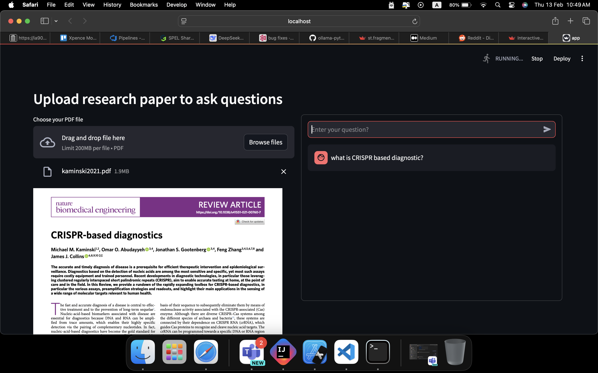
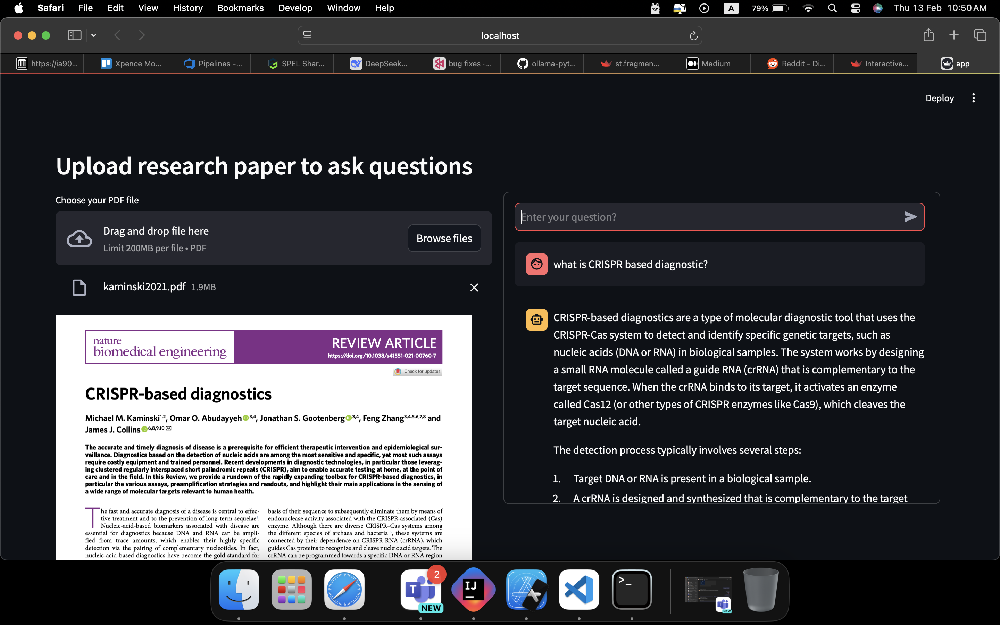

# Research Paper Q&A with AI 🔍📄

A interactive tool for exploring research papers through AI-powered question answering. Upload PDFs and get instant answers using state-of-the-art language models.

**Powered by:**
- 🦙 Ollama LLaMA 3.2:3b (answer generation)
- 📊 Nomic-Embed-Text (embedding generation)




## Features ✨
- PDF document upload and parsing
- Semantic search through research papers
- Natural language Q&A interface
- Local inference processing
- Vector embedding storage

## Technologies Used 🛠️
- **Language Model**: [Ollama LLaMA 3.2:3b](https://ollama.ai)
- **Embeddings**: [Nomic-Embed-Text](https://nomic.ai)
- **Document Processing**: `pdfplumber`
- **Vector Storage**: `chromadb`
- **UI Framework**: [Streamlit](https://streamlit.io)

## Prerequisites 📋
- Python 3.8+
- Ollama installed and running locally

## Installation ⚙️

1. **Set up Ollama models**:
```
ollama run llama3.2:3b
ollama pull nomic-embed-text
```

2. **Sample requirements.txt**:
```
ollama>=0.1.2
pdfplumber>=0.10.0
chromadb>=0.4.24
streamlit>=1.32.0
streamlit-pdf-viewer>=0.9.0
```


# Usage 🚀

## Start the Streamlit application:

``` python3 -m streamlit run app.py ```


